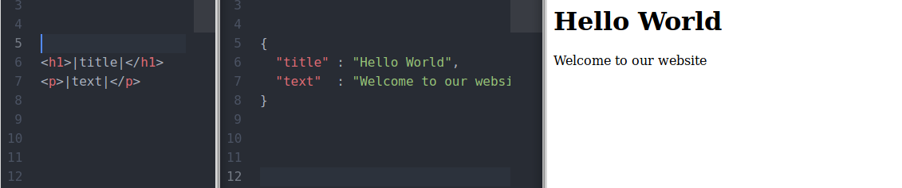
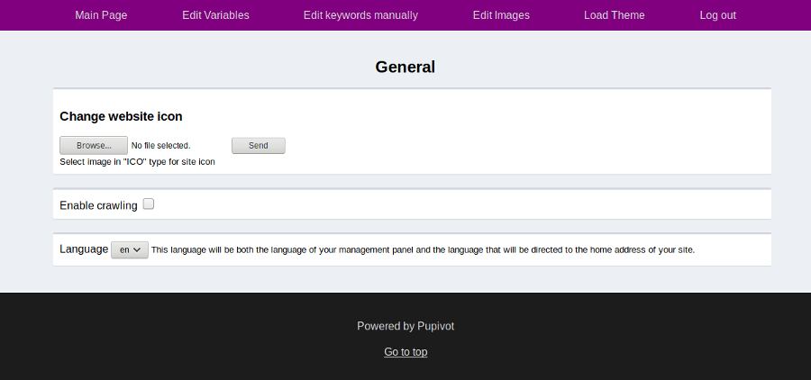

# pupivot

Sometimes you need a static website for yourself or your client. What if someone wants a change? Will you connect with ftp and make changes everytime?

No. You don't need to lose time. As you can see in the picture, you can type html once and change the content from the admin panel. Also, your customers won't bother you for changes.

## Features

- Create your template and change its contents from the admin panel
- Easily make your website multi-language
- You can get your website backup
- You don't have to prepare robots.txt and sitemap.

## Documentation & Installation Guide

Delete unnecessary objects after using them first(.gitignore, LICENSE, README.md, pupivot.png, adminPanel.png). Then open "backend/config.php" and edit for your server. After, open "backend/settings.json" and change your mail and password. **Type your password encrypted with md5**

Install the code on your server. Enter your admin panel by typing "admin/". Log in with the password and mail address you specified in settings. go to "Load Theme", select your theme, and load it.

> Don't forget to open crawling when you're done

## Creating Own Theme

Pupivot uses keywords and variables. Keywords creates the content of the website. Variables can be used in keywords. For example you can write " &lt;h1&gt;|welcomeMessage|&lt;/h1&gt; " in html, " 'welcomeMessage':'Welcome to &#126;websiteName&#126;' " in keywords and " 'websiteName':'Good Website' ". When someone opens the page, he sees the "Welcome to Good Website" article in the title h1\. You must create variables that contain page names. For example, if you have an aboutPage.html file, you must define the "aboutPage" variable as the name of that page. Also there are some predefined variables:

- URL : Returns the homepage link (<https://example.com/>)
- URLL : Returns the homepage link with language extension (<https://example.com/en/>)
- THISPAGENAME : Returns the name of that page.
- SITENAME : Returns the site name

For creating theme, create folder. In this folder, create folders named "assets", "backend", and "pages". You can put your assets in the asset folder. But it's important to put your pictures in the "assets/img/" folder. Put your all pages to "pages" folder with html format. Write your variables with &#126;VARIABLE&#126; and keywords with |KEYWORD|. In "backend" folder, put your website's header, footer and 404 page with html extensions. And create folder "data/en/". In "en" (it represents english) folder, create "content.json" and "variables.json". Put your data on there.

After loading your theme, you can add other languages.

You can see the example theme in theme folder.

## License

Pupivot is an open source project that is licensed under [MIT](http://opensource.org/licenses/MIT).
